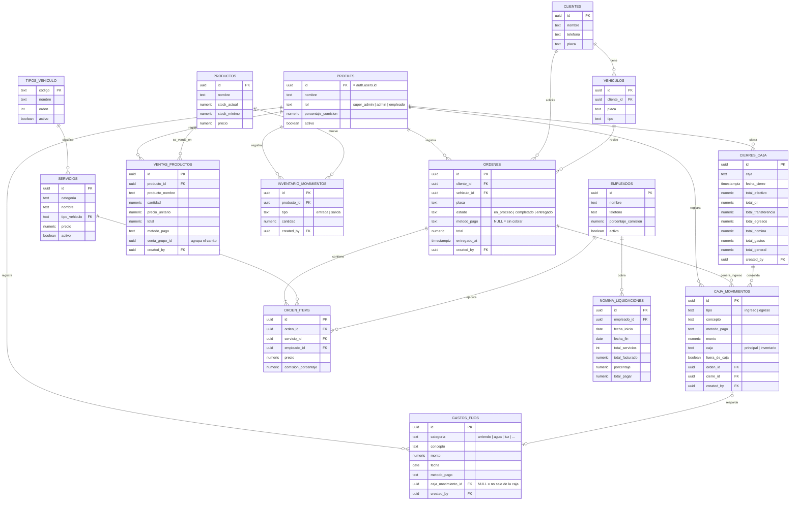

# Montar la base de datos en Supabase (presentación)

Tres archivos, en este orden. Cada uno se pega completo en **Supabase → SQL Editor → New query → Run**.

| # | Archivo | Qué hace |
|---|---------|----------|
| 0 | `00_borrar_tablas_de_prueba.sql` | Borra el esquema del primer intento (`ventas`, `venta_items`, y `productos`/`clientes` solo si son las de prueba). Si no encuentra ese esquema, aborta sin tocar nada. |
| 1 | `01_schema_completo.sql` | Crea las **15 tablas** del proyecto con sus llaves, restricciones, índices y comentarios, más el catálogo de servicios y tipos de vehículo. |
| 2 | `02_datos_demo.sql` | Llena la base con un día de operación de ejemplo (órdenes, caja, ventas, nómina, cierre). |

Entre el paso 1 y el 2 hay que **crear el usuario**: Authentication → Users → Add user, y después

```sql
insert into public.profiles (id, nombre, rol)
values ('EL-UUID-DEL-USUARIO', 'Tu Nombre', 'super_admin');
```

Casi todas las tablas guardan *quién* registró cada cosa (`created_by`), por eso hace falta al menos un perfil antes de sembrar datos.

Para ver el diagrama ya montado: **Database → Schema Visualizer**.

> Estos archivos crean las **tablas**. La lógica de negocio (funciones `crear_orden`, `cobrar_orden`, `cerrar_caja`, `liquidar_nomina`…) y las políticas RLS están en `backend/migrations/0002` → `0036`. Si querés la aplicación funcionando de verdad contra esta base, corré esas migraciones en orden en vez de este esquema consolidado.

---

## Modelo entidad-relación



### Cómo leerlo

- **`profiles` vs `empleados`.** Son cosas distintas a propósito: `profiles` son los **usuarios que inician sesión** (1:1 con `auth.users`, el módulo de autenticación de Supabase); `empleados` es el **roster de trabajadores** del lavadero, que no tienen cuenta pero sí comisión y nómina.
- **El flujo del negocio.** `ordenes` → `orden_items` (qué servicios y quién los hizo) → `caja_movimientos` (el cobro) → `cierres_caja` (el corte del día) → `nomina_liquidaciones` (la comisión del trabajador).
- **Dos cajas separadas.** `caja_movimientos.caja` distingue la caja `principal` (servicios) de la de `inventario` (venta de productos); cada una se cierra por aparte.
- **Integridad del historial.** Las llaves hacia `profiles` son `ON DELETE RESTRICT`: un usuario se desactiva (`activo = false`), no se borra, para no perder de quién era cada registro. En cambio `orden_items` es `ON DELETE CASCADE` respecto de `ordenes`: si se elimina una orden, sus ítems se van con ella.
- **Fotos históricas.** `ventas_productos.producto_nombre` y `orden_items.precio` guardan el valor del momento: aunque después cambie el precio o se borre el producto, la venta pasada no se altera.
