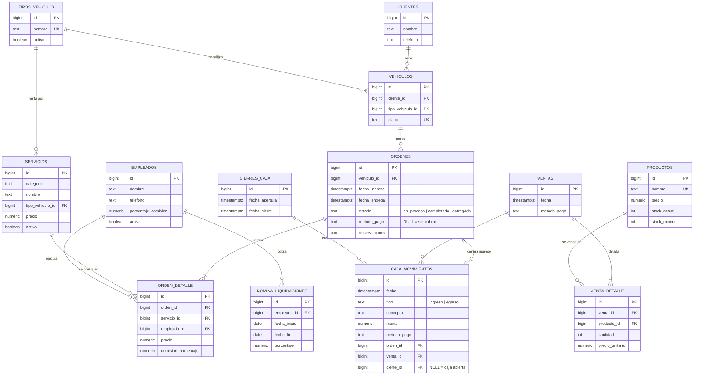

# Montar la base de datos en Supabase (presentación)

Hay **dos versiones** del mismo sistema.

| Carpeta | Qué es | Para qué |
|---|---|---|
| **`reducido/`** | **13 tablas + 4 vistas, modelo normalizado** | **La de la presentación.** Un solo archivo: borra, crea y deja datos de ejemplo cargados. |
| `completo/` | 15 tablas | Lo que corre en producción hoy, tal cual: con auditoría (`created_by`), gastos fijos y totales guardados. |

## Cómo montarlo

Un solo paso: pegar **`reducido/01_borrar_y_crear.sql`** completo en **Supabase → SQL Editor → New query → Run**.

Borra lo que haya, crea las tablas y las vistas, y siembra un día de operación. Se puede correr las veces que haga falta. ⚠️ **Empieza borrando**: solo en el Supabase de la presentación.

Después: **Database → Schema Visualizer** para ver el diagrama. Al final del archivo hay consultas listas para mostrar en la sustentación.

Ya no hace falta crear usuario ni fila en `profiles`: el modelo académico no depende del login de Supabase.

## Qué se corrigió respecto de la primera versión

El profesor señaló que había demasiados ids y pidió normalizar. Los cuatro cambios:

1. **Fuera los ids que no son del negocio.** `created_by` estaba en cinco tablas y `profiles` existía solo para engancharse a `auth.users`. Eso es auditoría de la aplicación, no del modelo: seis columnas de id y una tabla menos.
2. **La placa vive en un solo lugar.** Estaba repetida en `clientes` y en `ordenes` — una dependencia transitiva. Vuelve la entidad `vehiculos`: el cliente tiene vehículos y la orden apunta al vehículo.
3. **La venta de productos tiene cabecera.** Antes las líneas del carrito se agrupaban con un `venta_grupo_id` suelto y repetían fecha y método de pago en cada fila. Ahora es `ventas` + `venta_detalle`, el modelo clásico de factura.
4. **No se guarda nada calculado.** Se fueron `ordenes.total`, los totales de `cierres_caja` y el `total_pagar` de la nómina: todos salen de vistas (`v_ordenes`, `v_ventas`, `v_cierres`, `v_nomina`). Un total no puede quedar en desacuerdo con su detalle.

Además, los ids son enteros (1, 2, 3) en vez de UUID, para que se lean en la sustentación.

**Resultado: 13 tablas, 13 llaves foráneas (antes 23), tercera forma normal sin excepciones.**

> En producción varias de esas decisiones van al revés a propósito: UUID porque los ids viajan en la URL, `created_by` porque el negocio necesita saber quién registró cada cobro, y totales guardados porque un cierre de caja es un documento contable que no puede cambiar si alguien corrige un movimiento viejo. Son dos objetivos distintos: el modelo académico busca pureza; el de producción, trazabilidad.

---

## Modelo entidad-relación

Las vistas (`v_ordenes`, `v_ventas`, `v_cierres`, `v_nomina`) no aparecen en el diagrama porque no son entidades: son consultas guardadas que calculan los totales.

### Cómo leerlo

- **El muchos a muchos.** `ordenes` ↔ `servicios` se resuelve con `orden_detalle`, que además guarda atributos de la relación: el precio cobrado, el porcentaje pactado y quién hizo el trabajo. Igual `ventas` ↔ `productos` con `venta_detalle`.
- **El flujo del negocio.** `clientes` → `vehiculos` → `ordenes` → `orden_detalle` → `caja_movimientos` → `cierres_caja`, y por otro lado `empleados` → `orden_detalle` → `nomina_liquidaciones`.
- **Una llave que codifica un estado.** Mientras `caja_movimientos.cierre_id` sea nulo, el movimiento está en la caja abierta; al cerrar recibe el id del corte.
- **De dónde viene la plata.** `caja_movimientos` apunta a la orden o a la venta que lo originó, y un `CHECK` con `num_nonnulls` impide que apunte a las dos a la vez. Los movimientos sueltos (compras, nómina) no apuntan a ninguna.
- **Integridad.** `CASCADE` donde el hijo no existe sin el padre (`orden_detalle` → `ordenes`, `venta_detalle` → `ventas`, `vehiculos` → `clientes`); `RESTRICT` en los catálogos, para que no se borre un servicio o un trabajador con historial; `SET NULL` en lo opcional, para que borrar una orden no borre la plata que entró por ella.
- **Precio en el detalle.** `orden_detalle.precio` y `venta_detalle.precio_unitario` no son redundancia: son el precio al que se cobró *esa vez*. Es un atributo del hecho, no del catálogo — el mismo criterio de cualquier modelo de factura.
