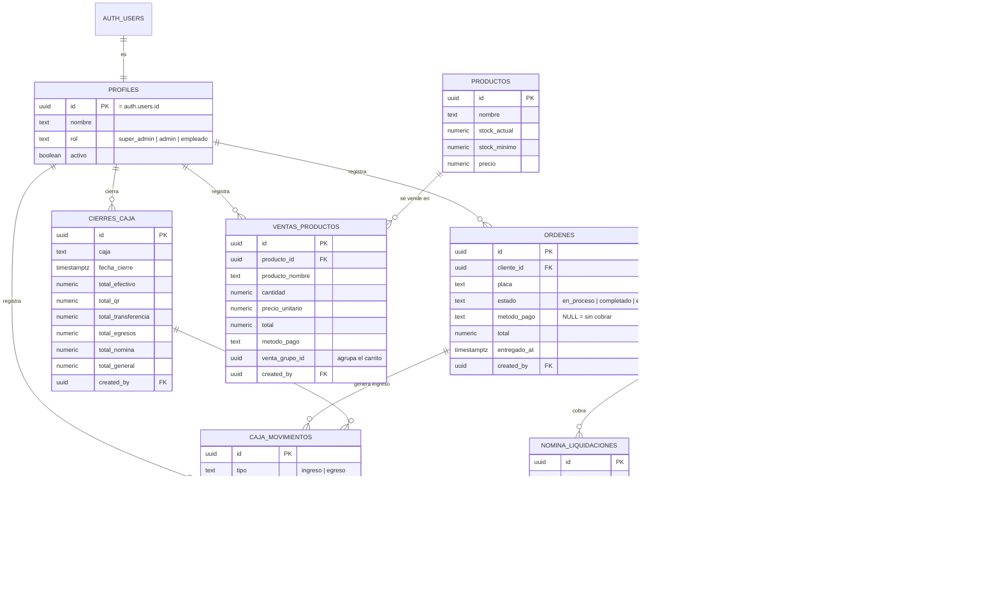

# Montar la base de datos en Supabase (presentación)

Hay **dos versiones** del mismo sistema. Para sustentar conviene la reducida.

| Carpeta | Tablas | Para qué |
|---|---|---|
| **`reducido/`** | **12** | **La de la presentación.** Conserva el hilo completo del negocio y todos los conceptos que se evalúan, pero se explica entero en una sustentación. |
| `completo/` | 15 | Lo que corre en producción hoy. Agrega gastos fijos (arriendo y servicios), vehículos e historial de stock. |

Lo que se recortó en la versión de 12: `gastos_fijos`, `vehiculos` (la orden se queda con la placa directa) e `inventario_movimientos`, más algunas columnas de detalle operativo.

## Orden de ejecución

Cada archivo se pega completo en **Supabase → SQL Editor → New query → Run**.

1. `00_borrar_tablas_de_prueba.sql` — solo si el proyecto todavía tiene el esquema del primer intento (`ventas`, `venta_items`). Si no lo encuentra, aborta sin tocar nada.
2. `reducido/01_schema.sql` — crea las 12 tablas con sus llaves, restricciones e índices, más el catálogo de servicios.
3. **Crear el usuario**: Authentication → Users → Add user, y después:
   ```sql
   insert into public.profiles (id, nombre, rol)
   values ('EL-UUID-DEL-USUARIO', 'Tu Nombre', 'super_admin');
   ```
   Casi todas las tablas guardan *quién* registró cada cosa (`created_by`), por eso hace falta un perfil antes de sembrar datos.
4. `reducido/02_datos_demo.sql` — un día de operación de ejemplo.

Para ver el diagrama ya montado: **Database → Schema Visualizer**.

> Estos archivos crean las **tablas**. La lógica de negocio (funciones `crear_orden`, `cobrar_orden`, `cerrar_caja`, `liquidar_nomina`…) y las políticas RLS están en `backend/migrations/0002` → `0036`. Si querés la aplicación funcionando de verdad contra una base nueva, corré esas migraciones en orden en vez de estos esquemas consolidados.

---

## Modelo entidad-relación (versión de 12 tablas)



### Cómo leerlo

- **`profiles` vs `empleados`.** Son cosas distintas a propósito: `profiles` son los **usuarios que inician sesión** (uno a uno con `auth.users`, comparten la llave primaria); `empleados` es el **roster de trabajadores**, que no tienen cuenta pero sí comisión y nómina.
- **El muchos a muchos.** `ordenes` ↔ `servicios` se resuelve con la tabla asociativa `orden_items`, que además guarda atributos propios de la relación: el precio cobrado, el porcentaje de comisión y quién ejecutó el trabajo.
- **El flujo del negocio.** `ordenes` → `orden_items` → `caja_movimientos` (el cobro) → `cierres_caja` (el corte del día) → `nomina_liquidaciones` (la comisión).
- **Una llave que codifica un estado.** Mientras `caja_movimientos.cierre_id` sea nulo, el movimiento está en la caja abierta; al cerrar recibe el id del cierre y los totales quedan congelados.
- **Dos cajas separadas.** `caja_movimientos.caja` distingue la caja `principal` (servicios) de la de `inventario` (venta de productos); cada una se cierra por aparte.
- **Integridad del historial.** Las llaves hacia `profiles` son `ON DELETE RESTRICT`: un usuario se desactiva (`activo = false`), no se borra. `orden_items` es `ON DELETE CASCADE` respecto de `ordenes`: si se elimina una orden, sus ítems se van con ella. Y lo opcional es `ON DELETE SET NULL`: borrar una orden no borra el dinero que entró por ella.
- **Fotos históricas.** `orden_items.precio` y `ventas_productos.producto_nombre` guardan el valor del momento: aunque después cambie la tarifa o se borre el producto, lo que ya pasó no se reescribe.
